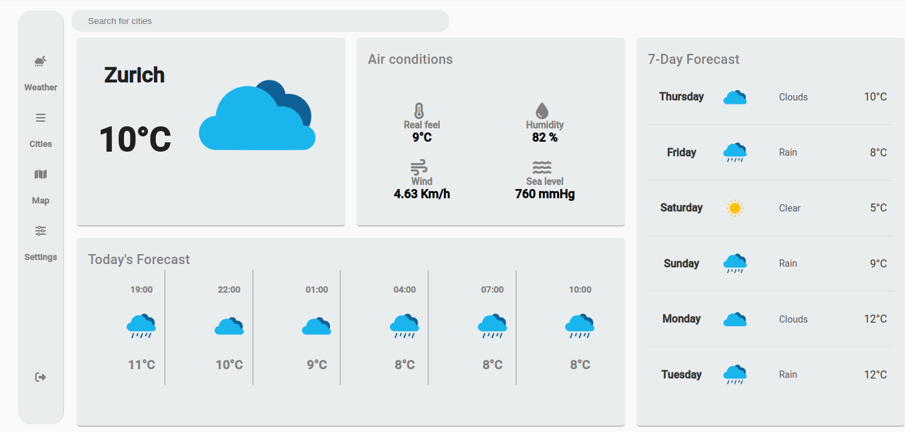
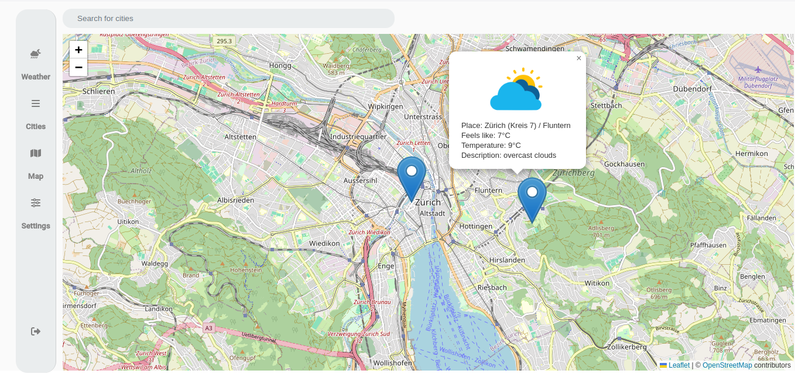
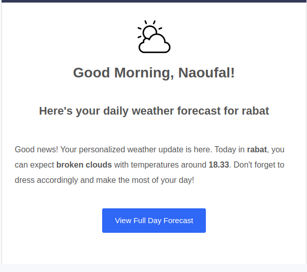

# ClimatiQ - Weather Web App

## Table of Contents
- [Introduction](#introduction)
- [Technologies Used](#technologies-used)
- [Installation](#installation)
- [Usage](#usage)
- [Screenshots](#Screenshots)
- [License](#license)


## Introduction
Climatiq is a comprehensive weather forecasting web application that allows users to check real-time weather conditions, view weather forecasts for multiple cities via a dashboard or interactive map, and receive daily weather updates via email. Users can sign up and authenticate using OAuth 2.0 or JWT. The application provides both metric and imperial units and comes with customizable user settings such as notifications, dark mode, and more.
For a demo of the application, please check out this [YouTube video](https://youtu.be/k-FPgf-z250).


## Features
- **Real-Time Weather Data**: Current weather information for selected cities, including temperature, humidity, wind speed, and sea level pressure.

- **Dashboard View**: Allows users to monitor weather conditions for multiple cities simultaneously.
- **Map Integration**: Displays weather conditions for cities using an interactive map (OpenStreetMap).
- **7-Day and Hourly Forecasts**: Provides detailed forecasts for the upcoming week and hourly breakdowns for selected days.
- **Custom Notifications**: Sends daily weather updates to users via email using Celery.
- **User Settings**: Includes unit preferences (Celsius/Fahrenheit, km/h or mph, etc.), notifications,dark mode, and personal information management.
- **Authentication**: Secure user authentication using JWT and OAuth 2.0 protocols.


## Technologies Used
   **Frontend**
   - **Angular**: The frontend is built using Angular for a dynamic and responsive user experience.

   **Backend**
   - **Django**: The backend is developed in Django, providing a secure and scalable framework for handling data and user requests.
   - **Celery**: For sending daily weather updates to users asynchronously via email.

   **Data Source**
   - **Weather API**: Uses third-party weather data provider (OpenWeatherMap) for fetching real-time and forecast weather data.

  **Authentication**
  - **JWT (JSON Web Tokens)**: For stateless user authentication and authorization.

  - **OAuth 2.0** : Enables third-party login integration for a seamless user experience.


## Installation
To install and run ClimatiQ locally, follow these steps:

1. Clone the repository:
    ```bash
    git clone https://github.com/leoben5456/ClimatiQ.git
    ```
2. Frontend Setup (Angular):
    - Navigate to WeatherApp

    ```bash
    cd ClimatiQ/WeatherApp/
    ```
    - Install the necessary Angular dependencies:
    ```bash
    npm install
    ```
    - Start the Angular development server:
    ```bash
    ng serve
    ```
3. Backend Setup (Django)
   - Navigate to Weather_Backend
   ```bash
    cd ClimatiQ/Weather_Backend/
    ```
   - Use Python's venv to create a virtual environment to isolate the project dependencies:
   ```bash
    python -m venv venv
    ```
   - Activate the Virtual Environment 
   ```bash
    source venv/bin/activate
    ```
   - Install Dependencies 
   ```bash
    pip install -r requirements.txt
    ```
   - Set Up Environment Variables
   create a .env file in the project root.
   ```bash
    EMAIL_HOST_USER=your_email_host_user
    EMAIL_HOST_PASSWORD=your_email_host_password
    WEATHER_API_KEY=your_weather_api_key
    WEATHER_ALERTS_API_KEY=your_weather_alerts_api_key
    SOCIAL_AUTH_GOOGLE_OAUTH2_KEY=your_google_oauth2_key
    SOCIAL_AUTH_GOOGLE_OAUTH2_SECRET=your_google_oauth2_secret

    ```
4. Running Celery with Docker
This project uses Celery for handling background tasks. Celery runs in a separate container managed by Docker alongside the Django application.

   - Running Docker Services
   ```bash
    docker-compose up --build
    ```
   


## Usage
 This weather application provides real-time weather updates, forecasts, and interactive maps for different cities. The application also includes customizable settings, allowing users to tailor the experience based on their preferences. Below are the key features and usage instructions:


**1. Weather Dashboard**
The main dashboard shows current weather conditions for a selected city, including:
- **Temperature**: Displayed prominently in Celsius or Fahrenheit.
- **Air Conditions**: Information such as real feel, humidity, wind speed, and sea-level pressure.
- **7-Day Forecast**: Displays the forecast for the upcoming week.
- **Today’s Forecast**: Detailed hourly forecast for the current day.

**2. City Overview**
Users can select from a list of cities on the left-hand panel or use the search bar to find a specific city. Each selected city will display:
- **Current Weather**: Real-time temperature and weather condition.
- **Hourly Forecast**: Forecast for the day broken down by hours.
- **3-Day Forecast**: Overview of weather conditions for the next three days.

**3. Interactive Map**
Navigate to the map section to view weather conditions for different cities on an interactive map.
- **City Pins**: Clicking on a pin provides the weather details, such as temperature, real feel, and a brief description.
- The map allows users to explore different regions and see weather conditions across locations.


**4. Settings and Customization**
You can adjust the following preferences in the Settings tab:

- **Units**: Choose display units for temperature (C/F), wind speed (Km/h or M/h), sea-level pressure (hPa, mmHg, inHg), and humidity (% or g/m³).
- **Notifications**: Toggle weather notifications on or off.
- **General**: Enable 12-hour or 24-hour time format and location services for local weather data.
- **Themes**: Switch between light and dark mode.
- **Privacy**: Edit personal information and privacy settings.

After making changes, click **Save Changes** to apply them.
## Screenshots
Here are a few screenshots showcasing the key features of the project:

#### 1. Weather Dashboard


#### 2. Map Weather Integration


#### 3. Daily weather mail


For more screenshots, you can [view the complete image collection here](./images/).


## License
This project is licensed under the MIT License. See the [LICENSE](LICENSE) file for details.
